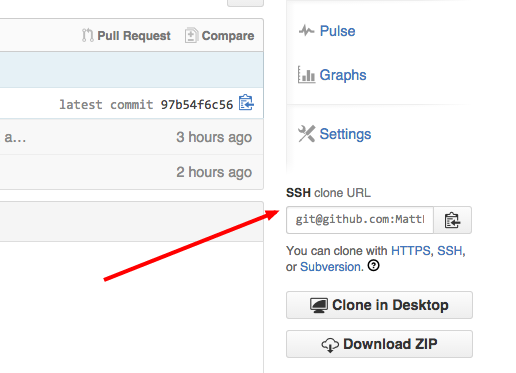
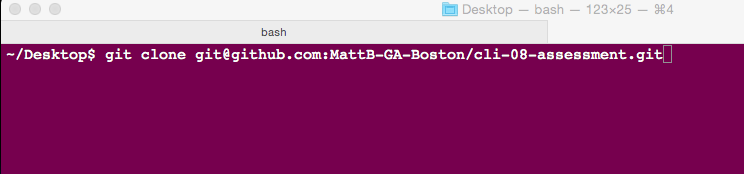
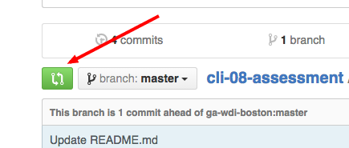
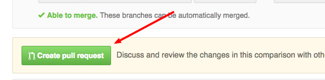

## Setup Instructions
- Fork this repository to your GitHub account.

- Copy the `ssh` link show on the right sidebar.

- Open your terminal and navigate to a place inside your filesystem where you'd like your local copy to live (Note: NOT inside another repo).

- Type `git clone ` + the URL that you just copied from GitHub.com, and hit enter. This will copy the repository from GitHub.com to your current location on computer.

- Finally, follow the directions given in `quiz.md`!

## Submitting Your Quiz

Once you finish answering all the questions (or run out of time), use the terminal to navigate to `cli_08-assessment` and enter the following commands one by one:

 `git add quiz`

 `git commit -m "Completed quiz."`

 `git push origin master.`

Finally, go back to the GitHub page for your fork (the place where you copied the URL). Click the green button whose mouseover text is "Compare, review, and create a pull request."; then click the green button that says "Create pull request."

That's it - you're done!

